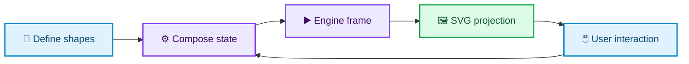
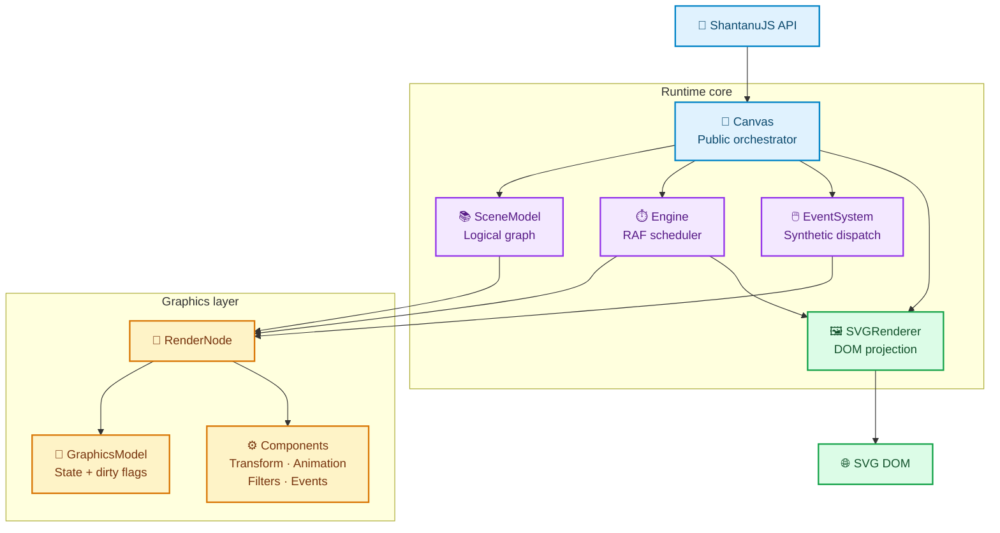
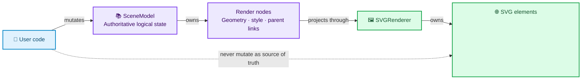
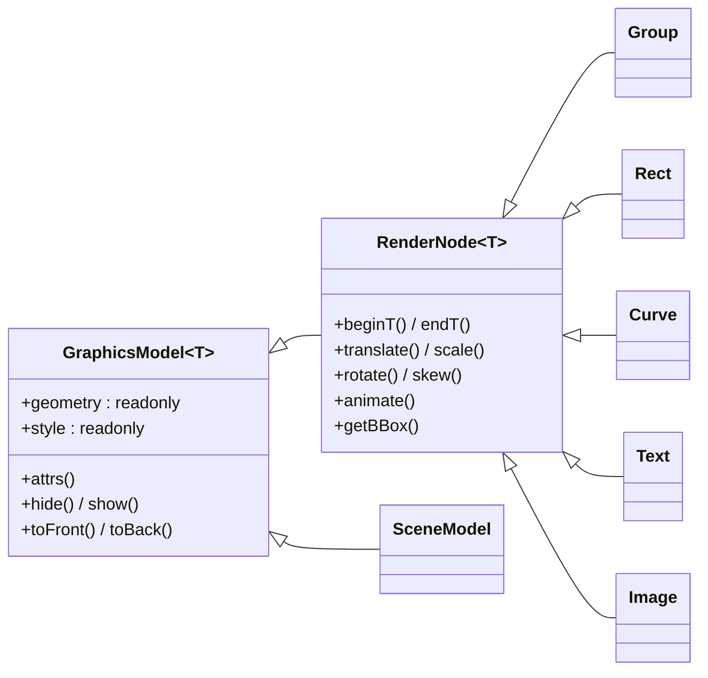
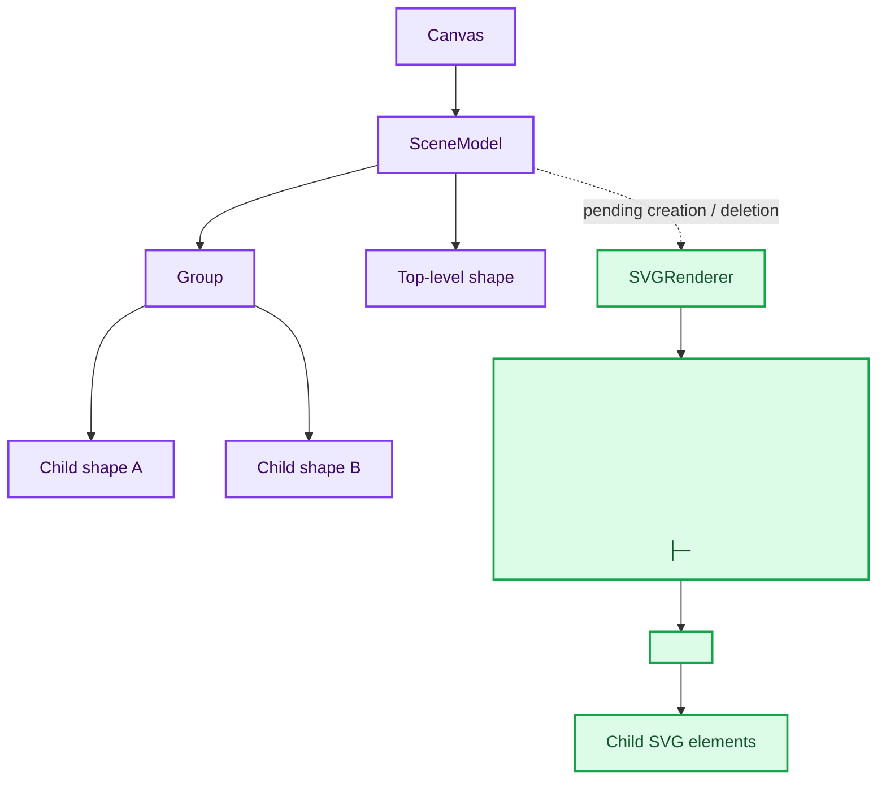
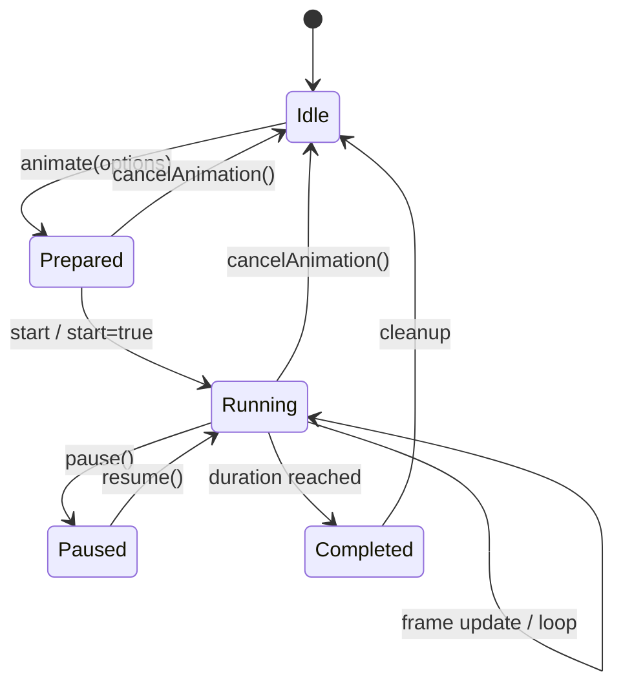
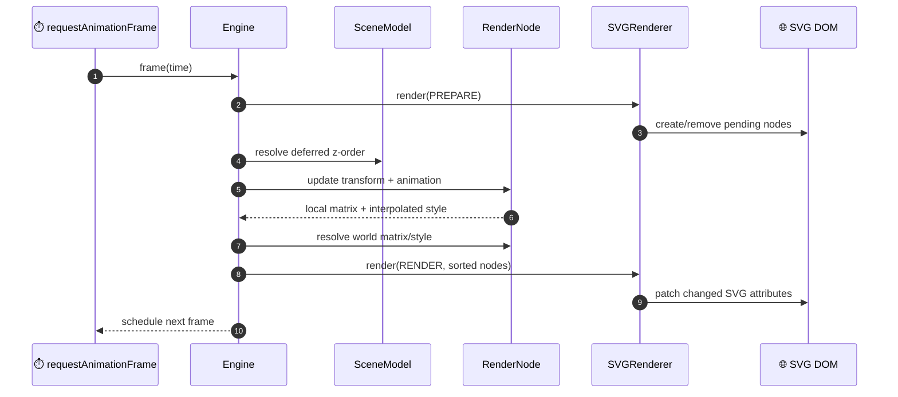
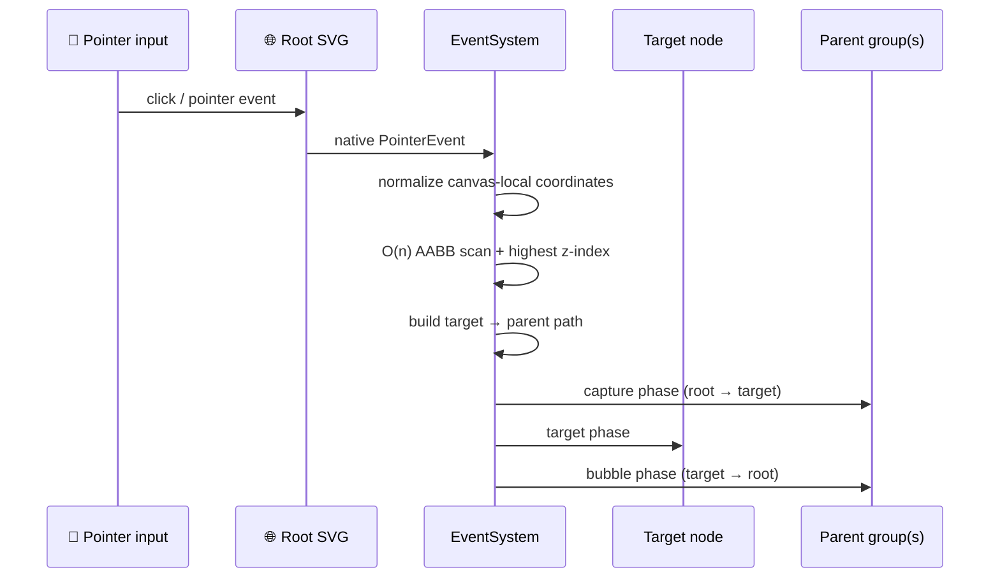

# ShantanuJS architecture

> **A matrix-driven 2D graphics runtime for the browser**



This document describes the implementation in this repository as of August
2026. It distinguishes verified behavior from future-looking design intent:
`SVG` is the only wired renderer, and event targeting is currently AABB based.

## Overview

ShantanuJS is a browser-side TypeScript library for 2D graphics and animation.
The public `ShantanuJS` namespace creates canvases, graphics primitives, media,
and groups. Shapes store canonical geometry and style; an engine continually
projects that state into an SVG DOM tree.

The package has no runtime package dependencies. Its runtime is nevertheless
browser-only because it requires DOM/SVG APIs, `requestAnimationFrame`,
`performance.now`, and `getComputedStyle`.

`src/index/index.ts` is the package entry point. It exposes:

| API | Constructors |
| --- | --- |
| `Canvas` | `Canvas` |
| `Shapes` | `Line`, `Point`, `Circle`, `Ellipse`, `Rect`, `Polyline`, `Polygon`, `QuadraticCurve`, `CubicCurve`, `ArcCurve`, `EarcCurve` |
| `Media` | `Text`, `Image` |
| Container | `Group` |

```text
src/
  core/graphics-model/       Base state and generic attribute API
  graphics/                  Render nodes, shapes, media, and groups
  components/                Transform, animation, filter, and event behavior
  systems/                   Canvas, scene, engine, SVG renderer, events
  utils/                     Affine/matrix, geometry, colour, animation helpers
  models/                    TypeScript contracts and property types
  property-definitions/      Common and shape-specific property definitions
  internal/keys/             Symbol capabilities for privileged operations
  errors/                    Error hierarchy and domain errors
  tests/                     Custom browser test harness and cases
```

## 🧭 Runtime topology



There are two hierarchies. `SceneModel` and `Group` own the authoritative
logical graph, while the SVG renderer owns its DOM projection. A canvas SVG
contains `<defs>`, a background/surface `<rect>`, and a content `<g>`.
Renderer DOM references are not authoritative state and can be recreated.

### Authority and ownership



## 🧱 Core graphics state

`GraphicsModel<T>` (`src/core/graphics-model/graphics-model.ts`) is the base
class of the scene and every renderable node. It owns:

- geometry: shape identity, shape fields, homogeneous coordinate buffer,
  transform stack, local/world matrices, bounds, z-index, and dirty flags;
- local and computed style, including an id; and
- the renderer's internal graphics-element reference.

Its public `geometry` and `style` are read-only views. `attrs()` is the normal
read/write boundary: an object updates fields, a string gets one value, and an
array gets several. `hide()`, `show()`, `toFront()`, and `toBack()` also live
here. Mutations invalidate state for a later engine frame.

`RenderNode<T>` extends that state with behavior. It lazily initializes
`Transformation`, `Animation`, `Filters`, and `EventTargets`, and exposes
`beginT`, `endT`, `translate`, `scale`, `rotate`, `skew`, `transform`,
`animate`, `animation`, `getBBox`, `events`, and `filters`. Concrete nodes must
generate a canonical buffer, restore shape attributes after transforms, and
validate their matrix.

### Graphics families

| Family | Location | Implementation role |
| --- | --- | --- |
| Primitives | `graphics/shapes/primitives` | Point, line, circle, ellipse, rectangle, polygon, and polyline. |
| Curves | `graphics/shapes/curves` | A generic sampled `Curve` plus quadratic, cubic, circular arc, and elliptical arc wrappers. |
| Media | `graphics/media` | SVG text and image render nodes. |
| Container | `graphics/container/group` | A render node that owns children and contributes a parent world matrix. |

Shape implementations keep the mapping between public properties and canonical
coordinates. The AABB utility derives transformed bounds from those coordinates.



## 🗂️ Scene and groups

`SceneModel` is a `GraphicsModel<"scene">` and the root container. `Canvas`
delegates `add`, `remove`, `clear`, `contains`, and `getAllElements` to it.

The scene maintains active elements, a `Map<node, index>` for membership, an
id-to-node map for event propagation, pending creation/deletion arrays for the
renderer, and deferred z-order work. `contains()` returns a 1-based position;
`0` means not present. Removal uses indexed swap/pop bookkeeping and leaves a
pending deletion for renderer cleanup.

`Group` is a `RenderNode<"g">` and an `IGraphicsContainer`. It must be added
to the canvas before it can accept shapes. Group membership updates the parent
relationship and moves the SVG projection under the group. Object-form group
`attrs()` only propagates `fill`, `stroke`, `stroke-width`, and `opacity` to
its current children; group transforms still affect children through world
matrix resolution.



## 🔄 Transform and animation

Transforms use affine matrices and homogeneous coordinate buffers in
`Float32Array`s. `utils/math/affine` contains creation, composition,
decomposition, parsing, and inverse operations; `utils/math/matrix` applies and
multiplies matrices. Pivot resolution is in `utils/geometry/pivot-resolution`.

`Transformation` handles individual translate/scale/rotate/skew operations
and a transform-expression DSL. `beginT()`/`endT()` batch operations before
they are finalized. In each dirty frame the engine derives a local matrix,
applies it to the canonical buffer, asks the concrete node to restore public
dimensions, then recursively composes parent and child world matrices. A
child's computed style is its group's computed style overlaid with local style.

`Animation` is per render node. It validates attrs, duration, easing, and
advanced options; separates geometry from style; interpolates numeric and
fill/stroke values; and supplies a frame matrix plus style updates to the
engine. It supports pause/resume/cancel/start, normal/reverse/alternate
direction, looping, sampled or polynomial transform interpolation, and
curve-following translation with an arc-length table. Render nodes prevent
overlapping active animations through their animation status checks.

### Transform control flow

```mermaid
flowchart LR
  Input["🧩 translate / scale / rotate / skew\nor transform DSL"] --> Transform["Transformation\nBuild affine matrix"]
  Transform --> Stack["Transform stack\nFloat32Array"]
  Stack --> Dirty["Mark local + world dirty"]
  Dirty --> Frame["⏱️ Next engine frame"]
  Frame --> Local["Resolve local matrix"]
  Local --> World["Compose parent world matrix"]
  World --> Buffer["Apply to homogeneous buffer"]
  Buffer --> Restore["Restore shape dimensions"]
  Restore --> Bounds["Recompute AABB"]
  Bounds --> SVG["🖼️ Render SVG attributes"]

  classDef command fill:#E0F2FE,stroke:#0284C7,color:#0C4A6E,stroke-width:2px;
  classDef math fill:#FEF3C7,stroke:#D97706,color:#78350F,stroke-width:2px;
  classDef frame fill:#EDE9FE,stroke:#7C3AED,color:#3B0764,stroke-width:2px;
  classDef output fill:#DCFCE7,stroke:#16A34A,color:#14532D,stroke-width:2px;
  class Input command;
  class Transform,Stack,Local,World,Buffer,Restore,Bounds math;
  class Dirty,Frame frame;
  class SVG output;
```



### Animation lifecycle



## ⏱️ Engine and SVG rendering

`Canvas` constructs `SceneModel`, selects a renderer, mounts the renderer's
root SVG, creates `Engine`, starts its RAF loop, and binds DOM events.

`Engine` continuously schedules `requestAnimationFrame`. `start()`/`stop()`
control it; `update(time)` manually runs a frame and `flush(time)` first marks
all nodes locally dirty. A frame performs:

```text
PREPARE renderer work (create/remove pending SVG nodes)
resolve deferred scene z-order
PREPARE again
update each dirty node's transform and active animation
resolve world matrices and computed styles
sort nodes by geometry.zIndex
RENDER active nodes to SVG
```

### One frame, end to end



`initRenderer()` currently recognizes only `"SVG"`; other contexts throw
`UnsupportedRenderingBackendError`. `SVGRenderer` initializes SVG scene
infrastructure, consumes scene creation/deletion queues, and synchronizes scene
and node geometry, styles, ordering, transforms, and filters. Geometry/style
caches are `WeakMap`s keyed by SVG element to avoid repeated writes. Filter
definitions are materialized into `<defs>` and cached by id. Implemented filter
types are blur, contrast, saturate, grayscale, hue rotation, shadow, and glow.

The engine does use dirty flags, but the canvas remains continuously scheduled;
it is not invalidation-driven while idle.

## 🖱️ Events

The root SVG receives `pointerdown`, `pointermove`, `pointerup`, `click`, and
`dblclick`. `EventSystem` normalizes viewport coordinates into canvas-local
coordinates, finds the topmost eligible node, builds its parent path, and
dispatches a `SyntheticEvent` through capture, target, and bubble phases.

Every node's `events` component supports one handler per type. `on()` and
`once()` replace any prior handler for that event type; `off()` removes it.

Target resolution scans the active element list and selects the highest-z node
whose `geometry.bounds` contains the pointer. This is O(n) and currently only
uses the AABB broad phase. The more precise `hitTestShape` call is present but
commented out, so areas inside a bounding box but outside a shape's actual path
may still receive the event.



> ⚠️ **Interaction precision:** Events currently use a bounding-box hit test.
> A future narrow phase should call the available shape-specific hit-testing
> utility before accepting the AABB candidate.

## 🔐 Encapsulation, errors, and utilities

`src/internal/keys` uses module-private symbols as capability tokens for
privileged access to mutable geometry/style, renderer DOM references, parent
links, components, scene queues, and engine hooks. This improves separation of
the public API and internal collaboration; it is not a browser security boundary.

Errors inherit from `ShantanuJSError` and carry `ErrorContext`. Error families
cover usage, state, configuration, and internal failures, with domains for
canvas, backend, animation, transforms, filters, colours, curves, geometry,
groups, and common invalid input/state.

The utility layer provides matrix/affine math; AABB, curve, pivot, and
interpolation routines; colour parsing and conversion; easing and animation
optimizations; and common property/validation helpers.

## 🧪 Build, testing, and known gaps

Rollup packages `src/index/index.ts` into UMD, ESM, and CommonJS outputs under
`dist/distribution`. The current Rollup configuration injects the development
flag as `true`.

```bash
npm run build
npm run lint
npx tsc --noEmit
npm test
```

At this document's update, `tsc --noEmit` completed successfully. ESLint does
not currently pass: `npm run lint` reports 838 errors, predominantly
import-boundary/import-order and naming-convention violations across existing
source files. `npm test` exits with “No test files found”: Vitest only discovers
`src/tests/**/*.test.ts`, whereas the repository uses a custom browser harness
and case files such as `add.ts` with `.sh.vtest.json` companions. Test discovery
or an adapter is needed before `npm test` verifies that existing suite.

## 🧩 Safe extension points

| Goal | Extension boundary |
| --- | --- |
| Add a shape | Extend `RenderNode`, define properties/types, implement its canonical-buffer and restore hooks, export it, and add SVG support if necessary. |
| Add a backend | Implement `IRenderer`, add a factory case in `initRenderer`, and keep backend resources renderer-owned. |
| Add a filter | Add contract and `Filters` support, then materialize it in `SVGFilters`/`SVGRenderer`. |
| Improve events | Complete and verify shape-specific narrow-phase hit tests in `EventSystem`. |
| Reduce idle work | Make `Engine` invalidation-driven while preserving animation wakeups. |

Do not use direct SVG mutation as a substitute for model mutation: the next
engine frame may overwrite it. Keep geometry derivation in concrete shape hooks,
and update logical parent links and SVG placement together when changing group
membership.
