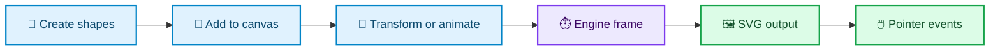
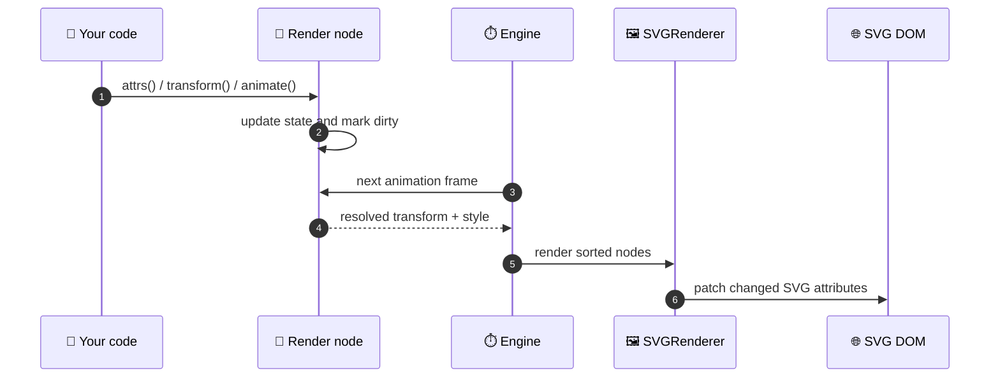

```text
  /$$$$$$  /$$                             /$$                                      /$$$$$  /$$$$$$ 
 /$$__  $$| $$                            | $$                                     |__  $$ /$$__  $$
| $$  \__/| $$$$$$$   /$$$$$$  /$$$$$$$  /$$$$$$    /$$$$$$  /$$$$$$$  /$$   /$$      | $$| $$  \__/
|  $$$$$$ | $$__  $$ |____  $$| $$__  $$|_  $$_/   |____  $$| $$__  $$| $$  | $$      | $$|  $$$$$$ 
 \____  $$| $$  \ $$  /$$$$$$$| $$  \ $$  | $$      /$$$$$$$| $$  \ $$| $$  | $$ /$$  | $$ \____  $$
 /$$  \ $$| $$  | $$ /$$__  $$| $$  | $$  | $$ /$$ /$$__  $$| $$  | $$| $$  | $$| $$  | $$ /$$  \ $$
|  $$$$$$/| $$  | $$|  $$$$$$$| $$  | $$  |  $$$$/|  $$$$$$$| $$  | $$|  $$$$$$/|  $$$$$$/|  $$$$$$/
 \______/ |__/  |__/ \_______/|__/  |__/   \___/   \_______/|__/  |__/ \______/  \______/  \______/ 
```                                                                                                
                                                                                                    
                                                                                                    

> **Lightweight 2D graphics and animation for the browser**

ShantanuJS is a zero-runtime-dependency TypeScript library for building
matrix-driven 2D scenes, transformations, animation, filters, and interaction
on an SVG surface.

> 🧪 **Pre-release:** The API and internals are still evolving. Use it for
> exploration and development, and pin versions carefully when integrating it.

## ✨ Why ShantanuJS?

| | Capability | What it means |
| :--: | --- | --- |
| 🔢 | **Math-first** | Shapes, transforms, curves, and animation operate from explicit geometry and affine matrices. |
| 🧱 | **Structured scene graph** | `Canvas`, `SceneModel`, and `Group` manage ownership, layering, and parent-child transforms. |
| 🎞️ | **Animation built in** | Interpolate geometry and style with easing, transform sampling, polynomial fitting, and curve motion. |
| 🖼️ | **SVG projection** | The implemented renderer efficiently synchronizes model state to SVG DOM elements. |
| 🎛️ | **Filters and events** | Use SVG-compatible filters and synthetic pointer-event propagation on render nodes. |
| 🧩 | **TypeScript-native** | Source contracts define public APIs, shape properties, rendering, animation, and event types. |



## 🚀 Quick start

Create an HTML host element, then construct a canvas and add a shape.

```html
<div id="stage"></div>
```

```ts
import { ShantanuJS } from "shantanujs";

const canvas = new ShantanuJS.Canvas({
  id: "stage",
  width: 800,
  height: 480,
  context: "SVG",
  fill: "#ffffff",
});

const rect = new ShantanuJS.Shapes.Rect({
  x: 80,
  y: 80,
  width: 180,
  height: 110,
  fill: "#2563eb",
  stroke: "#1d4ed8",
  "stroke-width": 2,
});

canvas.add(rect);

rect.rotate({ angle: 12, tType: "pivot" });
rect.animate({
  attrs: { translate: { x: 360, y: 0 } },
  duration: 1200,
  ease: "easeInOutCubic",
});
```

The canvas owns the rendering surface. Shapes remain regular JavaScript objects:
use `attrs()` to read or update properties, `getBBox()` to inspect bounds, and
the transform/animation methods to change their presentation.

> **Local source usage:** The package is not yet published as a stable npm
> package. The import above shows the intended consumer experience; when working
> from this repository, build first and import from the generated ESM bundle.

## 🧭 Core concepts

### Canvas and scene

`Canvas` is the entry point. It creates the SVG surface, owns the scene graph,
starts the frame engine, and connects native browser pointer events to the
library event system.

```ts
const canvas = new ShantanuJS.Canvas({
  id: "stage",
  width: 800,
  height: 480,
  context: "SVG",
});

canvas.add(shapeA, shapeB);
canvas.remove(shapeB);
canvas.clear();
```

### Shapes, media, and groups

| Category | Available constructors |
| --- | --- |
| Primitives | `Point`, `Line`, `Circle`, `Ellipse`, `Rect`, `Polyline`, `Polygon` |
| Curves | `QuadraticCurve`, `CubicCurve`, `ArcCurve`, `EarcCurve` |
| Media | `Text`, `Image` |
| Container | `Group` |

Add a group to the canvas before adding shapes to that group. Group transforms
flow down to their children, and supported group style writes are propagated to
current children.

```ts
const group = new ShantanuJS.Group({});
canvas.add(group);
group.add(rect);
group.rotate({ angle: 20, tType: "pivot" });
```

### Transformations

All transforms are affine-matrix operations. Apply them individually, batch
them with `beginT()` / `endT()`, or pass a transform expression.

```ts
rect.beginT();
rect.translate({ x: 40, y: 0, tType: "r" });
rect.scale({ sx: 1.2, sy: 1.2, tType: "p" });
rect.rotate({ angle: 15, tType: "pivot" });
rect.endT();

rect.transform("translate(24, 0) rotate(8) scale(1.05)");
```

### Animation

Call `animate()` with target attrs, duration, easing, and optional advanced
controls. The engine samples the active animation during its next frames.

```ts
rect.animate({
  attrs: {
    fill: "#9333ea",
    translate: { x: 260, y: 80 },
    rotate: { angle: 180 },
  },
  duration: 1000,
  ease: "easeOutCubic",
  advanceOptions: {
    controls: { direction: "alternate", loop: true },
  },
});
```

### Events and filters

Each render node exposes an event component and filter component.

```ts
rect.events.on("click", (event) => {
  console.log("Clicked:", event.target);
});

rect.filters.shadow("card-shadow", {
  offsetX: 4,
  offsetY: 6,
  blur: 8,
  color: "#000000",
  opacity: 0.25,
});
```

> ⚠️ Event targeting currently uses a shape’s axis-aligned bounding box (AABB).
> This is fast but is not yet exact path hit testing for every shape.

## ⚙️ How a change reaches the screen



For the complete implementation map, data ownership model, control flows, and
extension boundaries, see [ARCHITECTURE.md](./ARCHITECTURE.md).

## 📦 Installation and local development

### Package installation

Package publishing is planned. Once a stable release is available, install it
with your preferred package manager:

```bash
npm install shantanujs
# or: pnpm add shantanujs
# or: yarn add shantanujs
```

### Build from this repository

```bash
git clone https://github.com/ShanOrigin/ShantanuJS.git
cd ShantanuJS
npm install
npm run build
```

Build output is written to `dist/distribution` as UMD, ESM, and CommonJS bundles.

## 🛠️ Development commands

| Command | Purpose |
| --- | --- |
| `npm run build` | Clean, compile, and create distributable bundles. |
| `npx tsc --noEmit` | Type-check without emitting output. |
| `npm run lint` | Run the project ESLint configuration. |
| `npm test` | Run Vitest’s configured test discovery. |
| `npm run dev` | Run TypeScript watch mode and the local development server. |
| `npm run testing` | Run development services and the custom test server together. |

### Current verification status

- ✅ `npx tsc --noEmit` passes.
- ⚠️ `npm test` currently finds no files because the Vitest glob does not match
  the repository’s custom test-harness cases.
- ⚠️ `npm run lint` currently reports existing style and import-boundary issues.

## 🧩 Architecture at a glance

```text
Canvas
  ├─ SceneModel              logical scene ownership
  ├─ Engine                  requestAnimationFrame execution
  ├─ SVGRenderer             SVG DOM projection and filter resources
  └─ EventSystem             pointer normalization and propagation

RenderNode
  ├─ GraphicsModel           geometry, style, matrices, dirty state
  ├─ Transformation          affine operations and batching
  ├─ Animation               interpolation, easing, curve motion
  ├─ Filters                 declarative visual effects
  └─ EventTargets            one handler per supported event type
```

The renderer factory currently supports **SVG**. Canvas2D and WebGL are not
implemented backends yet.

## 🛣️ Project status

ShantanuJS is in active pre-release development. The math, scene, transform,
animation, SVG renderer, event, and filter systems are present and continue to
be refined. Public APIs may change before a stable `v0.1.0` release.

The primary near-term work is improving test execution/discovery, completing
precise shape hit testing, and hardening the package for release.

## 🤝 Contributing

Contributions are welcome—especially around graphics correctness, performance,
documentation, testing, and renderer development.

1. Open an issue for bugs, feature requests, or significant design proposals.
2. Keep changes scoped and include relevant test coverage where the harness
   supports it.
3. Run the available type-check, lint, and test commands before opening a PR.

Read the [contributing guide](./CONTRIBUTING.md) before submitting changes.

## 💡 Origin

ShantanuJS originated during the architectural work on
[Code Perspective](https://github.com/ShanOrigin/code-perspective), a project
for visualizing data structures and algorithms. It grew from an SVG experiment
into a dedicated graphics engine focused on explicit mathematics, transparent
rendering behavior, and a small runtime footprint.

## 👤 Maintainer

**Shantanu Suryawanshi**  
Creator and principal maintainer

## 📜 License

Copyright © 2024–2026 Shantanu Suryawanshi.

Licensed under [Apache-2.0](./LICENSE). You may use, study, modify, and
redistribute this project under the license terms.

---

<p align="center">
  <strong>Math first · Matrix driven · 2D graphics and animation</strong>
</p>
